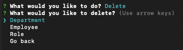
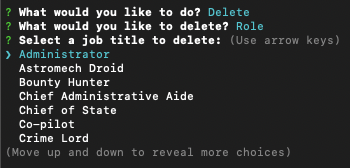

# Employee Tracker

## Description 

Employee Tracker is a command-line content management system designed to interface with and manage an employee database. This application was built using [Node.js](https://nodejs.org/en), [Inquirer](https://www.npmjs.com/package/inquirer/v/8.2.4), and [MySQL](https://www.mysql.com/). To explore the application, the repo includes schema and seed files for a sample database with three tables: ```employee```, ```department```, and ```role```.

This project required a deeper understanding of MySQL queries and how to interface with a MySQL database using Node.js. An extensive set of queries were developed to allow the user to retrieve desired data and to make modifications to the database. Available modifications include adding employees, departments, and roles; modifying an employee's role and manager; and deleting employees, departments, and roles.

Additionally, a multi-level command-line menu interface was required to navigate between and select the desired MySQL queries. Modularization was critical to create an easily scalable framework. After the basic modular structure was completed, it was easy to add additional capabilities and their corresponding menu options.


## Installation

Copy all files and folders from the repo to the desired location. On the command line, navigate to the installation directory and install dependencies with the command

```
npm install
```

Create and seed the database from a MySQL command line in the same directory, with the commands

```
source db/schema.sql;
source db/seeds.sql;
```
Update the password in file ```/lib/mysqlQuery.js``` as desired.


## Usage 

To run the application, use the command

```
npm start
```
or
```
node index.js
```
When the application is loaded, the user is presented with a welcome message and the main menu, with options **View**, **Add**, **Modify**, **Delete**, and **Exit**. Arrow keys are used to move up and down, and the Enter key is used to select the desired menu option.


After selecting **View**, the view menu is displayed. View menu options include **Departments**, **Roles**, **Employees**, and **Go back**, which returns the user to the main menu.


After selecting **Departments**, the view departments sub-menu is displayed. View departments menu options include **All Departments**, **Total Budget by Department**, and **Go back**, which returns the user to the view menu.


After selecting **All Departments**, a table is displayed listing all departments, and the user is returned to the main menu.


After selecting **Total Budget by Department** from the view departments sub-menu, a table is displayed listing all departments and their total budgets, sorted in descending order. (Total budgets are calculated by adding the salaries of all employee roles in each department.) The user is again returned to the main menu.


After selecting **Roles** from the view menu, a table is displayed listing all roles, sorted alphabetically, each with its respective salary and department. The user is returned to the main menu.


After selecting **Employees** from the view menu, the view employees sub-menu is displayed. View employees menu options include **Alphabetical by Last Name**, **Alphabetical by Department**, and **Alphabetical by Manager**.


After selecting **Alphabetical by Last Name**, a table is displayed listing all employees, including First Name, Last Name, Job Title, Salary, Department, Manager First Name, and Manager Last Name. The table is sorted in alphabetical order by last name. 

Selecting **Alphabetical by Department** or **Alphabetical by Manager** from the view employees sub-menu will display the same data with the specified sort criteria.


After selecting **Add** from the main menu, the add menu is displayed. Add menu options include **Add a department**, **Add a role**, **Add an employee**, and **Go back**, which returns the user to the main menu.


After selecting **Add a department**, the user is prompted to input a new department name. Input validation prevents the submission of an empty string.


After entering a new department name, the new department is added to the database, and the user is presented with a table of all departments sorted alphabetically, with the newly added department name formatted with light blue text. A success message is also displayed, and the user is returned to the main menu.


After selecting **Add a role** from the add menu, the user is prompted to input a new job title. Input validation prevents the submission of an empty string.


The user is then prompted to input a salary for the new role. Input validation requires this to be a number greater than or equal to zero.


The user is then prompted to select a department for the new role from a list of all current departments. The arrow and enter keys are used to make this selection.


After selecting the desired department, the new role is added to the database, the user is presented with a table of all current job titles sorted alphabetically, with the newly added role formatted with light blue text. A success message is also displayed, and the user is returned to the main menu.


After selecting **Add an employee** from the add menu, the user is prompted to input a first name for the new employee. Input validation prevents the submission of an empty string.


The user is then prompted to input a last name for the new employee. The last name can be left blank if desired.


The user is then prompted to select a manager for the new employee from a list of all current employees. The arrow and enter keys are used to make this selection.


After selecting the desired manager, the user is prompted to select a job title for the new employee from a list of all current roles. The arrow and enter keys are used to make this selection.


After selecting the desired role, the new employee is added to the database, and the user is presented with a table of all current employees sorted alphabetically by last name, with the newly added employee formatted with light blue text. A success message is also displayed, and the user is returned to the main menu.


After selecting **Modify** from the main menu, the modify menu is displayed. Modify menu options include **Employee role**, **Employee manager**, and **Go back**, which returns the user to the main menu.


After selecting **Employee role**, the user is prompted to select an employee to modify from a list of all current employees. The arrow and enter keys are used to make this selection.


After selecting an employee to modify, the user is prompted to select a new job title for the employee from a list of all current roles. The arrow and enter keys are used to make this selection.


After selecting the new role, the database is updated, a success message is displayed, and the user is returned to the main menu.


After selecting **Employee manager** from the modify menu, the user is prompted to select an employee to modify from a list of all current employees. The arrow and enter keys are used to make this selection.


After selecting an employee to modify, the user is prompted to select a new manager for the employee from a list of all current employees. The arrow and enter keys are used to make this selection.


After selecting the new manager, the database is updated, a success message is displayed, and the user is returned to the main menu.


After selecting **Delete** from the main menu, the delete menu is displayed. Delete menu options include **Department**, **Employee**, **Role**, and **Go back**, which returns the user to the main menu.



After selecting **Department**, the user is prompted to select a department to delete from a list of all current departments. The arrow and enter keys are used to make this selection.


After selecting the department to delete, the department is deleted from the database, a success message is displayed, and the user is returned to the main menu.


After selecting **Employee** from the delete menu, the user is prompted to select an employee to delete from a list of all current employees. The arrow and enter keys are used to make this selection.


After selecting the employee to delete, the employee is deleted from the database, a success message is displayed, and the user is returned to the main menu.


After selecting **Role** from the delete menu, the user is prompted to select a role to delete from a list of all current roles. The arrow and enter keys are used to make this selection.



After selecting the role to delete, the role is deleted from the database, a success message is displayed, and the user is returned to the main menu.


After selecting **Exit** from the main menu, a thank you message is displayed, and the application exits and returns the user to the command-line.


## Credits

I used [Node.js](https://nodejs.org/en) to build a command-line application.

I used [Inquirer](https://www.npmjs.com/package/inquirer/v/8.2.4) to create a menu system of user prompts and user input collection.

I used [MySQL](https://www.mysql.com/), specifically [MySQL 2](https://www.npmjs.com/package/mysql2), to interface with the database.

I used [CLI Table](https://www.npmjs.com/package/cli-table) to render unicode-aided tables on the command-line for presenting MySQL query results.

I used [chalk](https://www.npmjs.com/package/chalk/v/4.1.2) to provide color formatting and styling to the command-line.


## License

Please refer to the LICENSE in the repo.

---